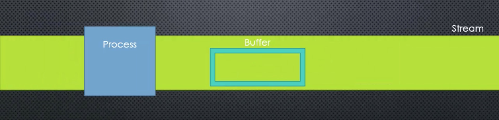

# Buffers and Streams :godmode:

## What are streams

Streams are objects that let you read data from a source or write data to a destination in continuous fashion. In Node.js, there are four types of streams −

- Readable − Stream which is used for read operation.

- Writable − Stream which is used for write operation.

- Duplex − Stream which can be used for both read and write operation.

- Transform − A type of duplex stream where the output is computed based on input.

## What are buffers

A buffer is a temporary holding spot for data being moved from one place to another. The diagram below shows how a buffer interacts with a stream.



The concept is like if you are watching a Youtube Video, you can start to watch a video without downloading the whole video. If your internet speed is too slow, you would see "buffering", that means the computer is trying to collect data in order for you to keep watching that video.

## Reading large files

Streams are useful because they allow us to read bits of large files as soon as they're available.

This repo has the entire Dracula book within it. :trollface:

We want to print this to the terminal and specify how often a section of text is streamed to the terminal using the command:

`
node our_file.js file_to_be_read.txt seconds(e.g. 1s)
`

**Setting up**
* Get the arguments to be entered in the command line

```javascript
var fs = require('fs');
var file = process.argv[2];
var time = process.argv[3] || null;
var readStream = fs.createReadStream(file, 'utf8');
```

**Error handling**

```javascript
readStream.on('error', (err) => {
  return err;
});
```

**The interesting bit**
* You can pause a stream as it's being read using `nameOfStream.pause()`
* And resume again with `nameOfStream.resume()`

```javascript
readStream.on('data', (chunk) => {
  if (time) {
    readStream.pause();
    var seconds = time.split('s')[0];

    setTimeout(function() {
      readStream.resume();
      console.log(chunk);
    }, 1000 * seconds);

  } else {
    console.log(chunk);
  }
});
```
**End**

```javascript
readStream.on('end', () => {
  console.log('completed');
});
```

### Using streams in servers
Both of the (req, res) arguments are streams, which means we can use fs.createReadStream() instead of fs.readFile(). With this,  users won't need to wait for the whole file to be buffered into memory on your servers before they can start receiving any content.

**For Example:**

```javascript
var http = require('http');
var fs = require('fs');

var server = http.createServer(function (req, res) {
    var stream = fs.createReadStream(__dirname + '/data.txt');
    stream.pipe(res);
});
server.listen(8000);
```

Here `.pipe()` takes care of listening for 'data' and 'end' events from the `fs.createReadStream()`. This code is not only cleaner, but now the `data.txt` file will be written to clients one chunk at a time immediately as they are received from the disk.

### Resources

[Simple overview of streams and buffers](https://www.sitepoint.com/basics-node-js-streams/)

[Node documentation on streams](https://nodejs.org/api/stream.html)

[What are streams?](https://www.tutorialspoint.com/nodejs/nodejs_streams.htm)

[What are buffers?](https://www.tutorialspoint.com/nodejs/nodejs_buffers.htm)

[What is a buffer in NodeJS](http://stackoverflow.com/questions/14551006/what-is-a-buffer-in-node-js)

[Stream handbook](https://github.com/substack/stream-handbook)

[Stream tutorial walkthrough](https://github.com/workshopper/stream-adventure)
